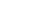
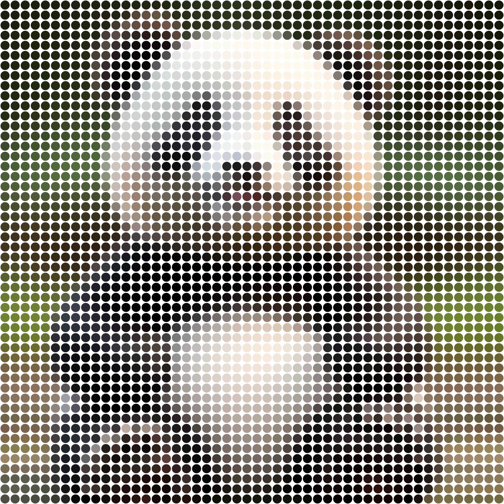
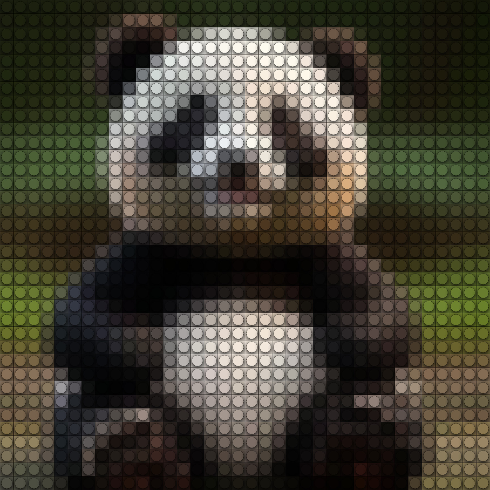

# Dotter
Convert image to dots / lego for no reason

## Example
This is the project using AI 

Original | Dotted | Lego | Lego colors
--- | --- | --- | ---
 |  |  | 

## Live
You can check demo [here]()
